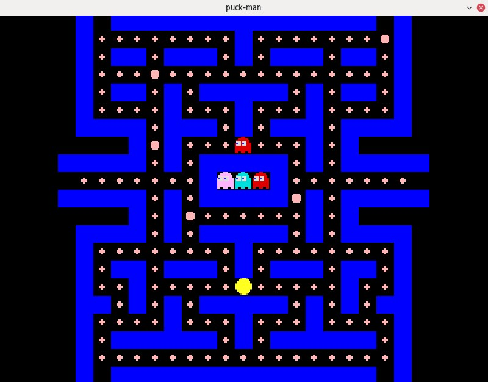
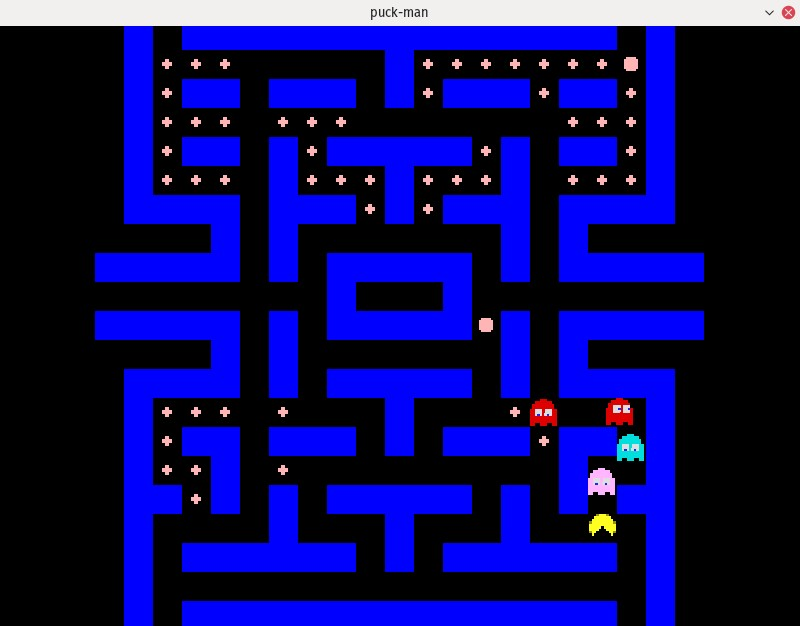

# puck-man

Rewrite of my 4th semester Computer Programming project (a Pac-Man like game) in Common Lisp and SDL2.

Build & Run:
------------

1. Install SDL2 and SDL_image 2.0
2. Download the sprites from [here]( https://github.com/rm-hull/big-bang/blob/master/examples/pacman/data/spritemap-384.png) and save them under `resources/spritemap.png`
3. Run the following in the project directory:
```common-lisp
$ sbcl
* (push '*default-pathname-defaults* asdf:*central-registry*)
(*DEFAULT-PATHNAME-DEFAULTS* ...)
* (asdf:load-system :puck-man)
...
* (game-main)
```

Screenshots:
------------




License:
--------

[MIT License](https://opensource.org/licenses/MIT)
